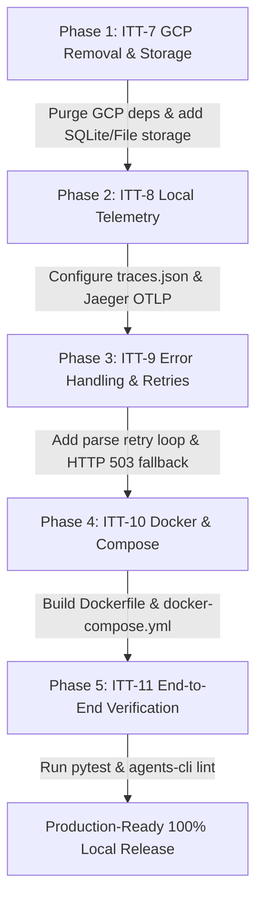

# Intelligent Ticket Triage (ITT) — Project Overview & Local Production Roadmap

## Overview

**Intelligent Ticket Triage (ITT)** is a production-grade AI system designed for automated analysis, categorization, service health verification, and routing of IT support tickets. 

The application is built to run **100% locally** on local infrastructure without any external Google Cloud Platform (GCP) or vendor cloud lock-in. All LLM inferences are served locally via **LM Studio** (OpenAI-compatible REST API v1), while session history, artifact storage, structured logging, and distributed tracing are handled by local open-source components and Docker containers.

### Local Technology Stack
- **Agent Engine & Orchestration:** [Google ADK (Agent Development Kit)](https://github.com/google/adk) & A2A (Agent-to-Agent) protocol.
- **LLM Inference Engine:** Local **LM Studio** (`http://192.168.0.195:1234/v1` via LiteLLM).
- **Data Validation & Schemas:** [Pydantic v2](https://docs.pydantic.dev/).
- **API Server & Routing:** [FastAPI](https://fastapi.tiangolo.com/) + Uvicorn.
- **Local Storage & Database:** Local Filesystem & SQLite (`./data/sessions.db`, `./data/artifacts/`).
- **Local Logging & Telemetry:** Standard Python JSON File Logging (`logs/triage.log`, `logs/feedback.jsonl`) & OpenTelemetry Dual Exporter (Local File `logs/traces.json` & Jaeger OTLP `http://localhost:4317`).
- **Containerization & Deployment:** Docker & Docker Compose (`docker-compose.yml` orchestrating FastAPI App & Jaeger UI).
- **Development Tooling:** `uv` package manager & `agents-cli`.

---

## 100% Local Solution Architecture

```
                                    +-----------------------------------+
                                    |        Client / System            |
                                    +-----------------------------------+
                                                      |
                                          POST /api/v1/triage (JSON)
                                                      v
                                    +-----------------------------------+
                                    |         FastAPI Controller        |
                                    +-----------------------------------+
                                                      |
                                           TicketRequest (Pydantic)
                                                      v
                                    +-----------------------------------+
                                    |      Google ADK Agent Engine      |
                                    |           (root_agent)            |
                                    +-----------------------------------+
                                       /              |              \
                                      /               |               \
               Tool Call             v                v                v            Tool Call
     +-----------------------------------+   +------------------+    +-----------------------------------+
     |    check_service_status(service)  |   |  LM Studio Local |    |    escalate_to_human(urgency)    |
     +-----------------------------------+   |   REST API v1    |    +-----------------------------------+
                                      \      | (192.168.0.195)  |       /
                                       \     +------------------+      /
                                        v                             v
                                    +-----------------------------------+
                                    |     Pydantic Structured Output    |
                                    |          (TriageResponse)         |
                                    +-----------------------------------+
                                                      |
                                          HTTP 200 OK | (HTTP 503 on error)
                                                      v
                                    +-----------------------------------+
                                    |  Local Logs & Jaeger Telemetry    |
                                    |     (logs/ & data/ volumes)       |
                                    +-----------------------------------+
```

---

## Workspace State & Current Architecture

### Completed Components (Epics 1 & 2)
1. **API Schemas (`app/schemas.py`):** `TicketRequest` and `TriageResponse` Pydantic v2 schemas defined with `TicketCategory` and `TicketPriority` enums.
2. **Local Model Setup (`app/agent.py`):** ADK `root_agent` configured with `LiteLlm` pointing to local LM Studio endpoint (`http://192.168.0.195:1234/v1`) using `LMSTUDIO_API_KEY`.
3. **External System Prompt (`app/prompts/triage_system.txt`):** System prompt defining persona, classification rules, priority levels, tool rules, and structured JSON requirements, loaded dynamically via `load_prompt()`.
4. **Business Tools (`app/tools.py`):** `check_service_status(service_name)` and `escalate_to_human(urgency_level)` implemented with type hints and Google-style docstrings, registered on `root_agent`.
5. **FastAPI Agent Endpoint (`app/api/v1/triage.py`):** `POST /api/v1/triage` connects input to ADK `runner.run_async`, handles tool calling, parses model output, and returns validated `TriageResponse`.
6. **Unit Test Suite (`tests/unit/`):** Passing unit tests covering schema validation, prompt loading, tool execution, local LiteLLM configuration, and mocked endpoint runner.

---

## Target Project Directory Structure

```
inteligent-ticket-triage/
├── app/                            # Core Application Package
│   ├── __init__.py
│   ├── agent.py                    # ADK root_agent & App definition (LM Studio)
│   ├── fast_api_app.py             # FastAPI entrypoint & Uvicorn startup
│   ├── tools.py                    # Business tools (check_service_status, escalate_to_human)
│   ├── schemas.py                  # Pydantic schemas (TicketRequest, TriageResponse)
│   ├── api/
│   │   └── v1/
│   │       └── triage.py           # POST /api/v1/triage route handler
│   ├── app_utils/                  # Local services & telemetry infrastructure
│   │   ├── __init__.py
│   │   ├── a2a.py                  # Agent-to-Agent protocol routes
│   │   ├── services.py             # SQLite session DB & local file artifact services
│   │   ├── telemetry.py            # Local OpenTelemetry logging & Jaeger tracing
│   │   └── typing.py               # Feedback schemas
│   └── prompts/                    # Externalized prompt templates
│       ├── __init__.py             # Dynamic prompt loader helper
│       └── triage_system.txt       # System prompt template
├── data/                           # Local Data Directory (Git-ignored)
│   ├── artifacts/                  # Local file artifact storage
│   └── sessions.db                 # Local SQLite session database
├── logs/                           # Local Logs Directory (Git-ignored)
│   ├── triage.log                  # Local application JSON logs
│   ├── feedback.jsonl              # User feedback log entries
│   └── traces.json                 # Local OpenTelemetry trace spans
├── tests/                          # Automated Test Suite
│   ├── unit/                       # Unit tests (schemas, tools, model, prompts, api, services)
│   └── integration/                # Integration tests for local server
├── Dockerfile                      # Lightweight Docker container definition (Python 3.11 + uv)
├── docker-compose.yml              # Multi-container compose (FastAPI App + Jaeger UI)
├── .env                            # Local environment variables
├── .gitignore                      # Excluded local data & logs
├── pyproject.toml                  # Project metadata & local dependencies (GCP-free)
├── agents-cli-manifest.yaml        # ADK CLI configuration
└── project_info.md                 # Project roadmap & architecture (this file)
```

---

## Detailed Project Backlog & Epics

### Epic 1: Project Skeleton & Local Infrastructure [COMPLETED]
*Focus: Setting up project environment, FastAPI entrypoints, Pydantic schemas, and LM Studio connectivity.*

| Task ID | Title | Status | Description & Acceptance Criteria (AC) |
| :--- | :--- | :--- | :--- |
| **ITT-1** | **Project Initialization via `agents-cli`** | **COMPLETED** | Standard ADK layout created, `pyproject.toml` generated, and `.env` configured. |
| **ITT-2** | **FastAPI & Pydantic Configuration** | **COMPLETED** | `TicketRequest` and `TriageResponse` schemas defined; initial `/triage` route skeleton mounted. |
| **ITT-3** | **Local Model Endpoint Configuration** | **COMPLETED** | ADK `LiteLlm` configured in `app/agent.py` pointing to LM Studio (`http://192.168.0.195:1234/v1`). |

---

### Epic 2: Core Agent Logic & Tooling (ADK Implementation) [COMPLETED]
*Focus: Prompt engineering, tool calling, and integrating agent reasoning into the FastAPI endpoint.*

| Task ID | Title | Status | Description & Acceptance Criteria (AC) |
| :--- | :--- | :--- | :--- |
| **ITT-4** | **System Prompt Engineering & Externalization** | **COMPLETED** | Prompt externalized in `app/prompts/triage_system.txt` and dynamically loaded in `app/agent.py`. |
| **ITT-5** | **Agent Tools Implementation** | **COMPLETED** | `check_service_status` and `escalate_to_human` tools implemented in `app/tools.py` and registered on `root_agent`. |
| **ITT-6** | **FastAPI Endpoint Agent Integration** | **COMPLETED** | `POST /api/v1/triage` integrated with ADK `runner.run_async`, returning validated `TriageResponse`. |

---

### Epic 3: 100% Local Production Hardening & GCP Removal [IN PROGRESS]
*Focus: Eliminating all Google Cloud dependencies (`google.auth`, `google.cloud.logging`, `VertexAiSessionService`, `GcsArtifactService`) and replacing them with 100% local open-source solutions.*

| Task ID | Title | Status | Detailed Implementation Plan & Acceptance Criteria (AC) |
| :--- | :--- | :--- | :--- |
| **ITT-7** | **GCP Dependency Purge & Local SQLite/File Storage** | **PLANNED** | **Implementation Plan:**<br>1. Remove `google.auth`, `google.cloud.logging`, `VertexAiSessionService`, `GcsArtifactService`, `gcsfs`, and `google-cloud-aiplatform` from `pyproject.toml` dependencies.<br>2. Refactor `app/app_utils/services.py` to use ADK `DatabaseSessionService` / SQLite (`data/sessions.db`) and `FileArtifactService` (`data/artifacts/`).<br>3. Refactor `app/fast_api_app.py` to remove `google.auth` / GCP Logging Client, replacing with standard Python logging (`logs/triage.log`) and appending user feedback to `logs/feedback.jsonl`.<br><br>**Acceptance Criteria:**<br>- Zero GCP imports in codebase.<br>- Sessions persist across restarts in `data/sessions.db`.<br>- Artifacts saved locally in `data/artifacts/`. |
| **ITT-8** | **Local OpenTelemetry & Jaeger Observability** | **PLANNED** | **Implementation Plan:**<br>1. Refactor `app/app_utils/telemetry.py` to purge GCP OpenTelemetry exporters.<br>2. Configure dual OpenTelemetry span exporter: log trace spans locally to `logs/traces.json` and export OTLP spans to Jaeger collector (`http://localhost:4317` or `http://jaeger:4317`).<br>3. Record token counts, latencies, and tool call traces locally without vendor cloud calls.<br><br>**Acceptance Criteria:**<br>- Telemetry initializes cleanly without cloud credentials.<br>- Trace spans logged to `logs/traces.json` and visible in Jaeger UI (`http://localhost:16686`). |
| **ITT-9** | **Parse Retries & Local Service Error Fallbacks** | **PLANNED** | **Implementation Plan:**<br>1. Update `app/api/v1/triage.py` to implement up to 2 retry attempts when model output fails `TriageResponse` Pydantic validation, sending error feedback back to the agent.<br>2. Wrap LM Studio agent execution in try-except blocks catching connection errors (`httpx.ConnectError`, `httpx.TimeoutException`, etc.) and return a structured `HTTP 503 Service Unavailable` response with diagnostic message.<br><br>**Acceptance Criteria:**<br>- Malformed model JSON automatically re-prompted up to 2 times.<br>- Unreachable LM Studio server gracefully returns HTTP 503 instead of unhandled 500 error. |

---

### Epic 4: Local Containerization & Production Deployment [PLANNED]
*Focus: Packaging the application with Docker & Docker Compose for one-command local deployment.*

| Task ID | Title | Status | Detailed Implementation Plan & Acceptance Criteria (AC) |
| :--- | :--- | :--- | :--- |
| **ITT-10** | **Docker & Docker Compose Infrastructure** | **PLANNED** | **Implementation Plan:**<br>1. Create `Dockerfile` using lightweight `python:3.11-slim` and `uv` package installer.<br>2. Create `docker-compose.yml` defining two services:<br>   - `app`: FastAPI Ticket Triage application on port `8000`.<br>   - `jaeger`: `jaegertracing/all-in-one:latest` (UI at `http://localhost:16686`, OTLP at `4317`).<br>3. Configure volume mounts (`./data` -> `/app/data`, `./logs` -> `/app/logs`, `./.env` -> `/app/.env`).<br>4. Configure `extra_hosts: host.docker.internal:host-gateway` for container-to-host LM Studio connectivity (`192.168.0.195:1234`).<br><br>**Acceptance Criteria:**<br>- `docker compose up -d` starts both services.<br>- Healthchecks pass and API responds at `http://localhost:8000/api/v1/triage`. |
| **ITT-11** | **End-to-End Verification & Quality Flywheel** | **PLANNED** | **Implementation Plan:**<br>1. Run complete unit and integration test suite (`uv run pytest tests/unit tests/integration`).<br>2. Execute `agents-cli lint` to ensure zero code quality warnings.<br>3. Perform end-to-end cURL test against live local LM Studio endpoint.<br><br>**Acceptance Criteria:**<br>- 100% test pass rate.<br>- Zero lint warnings.<br>- Verified live triage output from local stack. |

---

## Detailed Step-by-Step Execution Plan



1. **Phase 1 (GCP Removal - ITT-7):**
   - Update `pyproject.toml` to remove GCP packages.
   - Update `app/app_utils/services.py` for SQLite (`data/sessions.db`) & file artifacts (`data/artifacts/`).
   - Update `app/fast_api_app.py` for local JSON logging (`logs/triage.log` & `logs/feedback.jsonl`).
2. **Phase 2 (Local Telemetry - ITT-8):**
   - Refactor `app/app_utils/telemetry.py` to write spans to `logs/traces.json` and export OTLP spans to Jaeger (`http://localhost:4317`).
3. **Phase 3 (Resilience & Retries - ITT-9):**
   - Update `app/api/v1/triage.py` with 2-attempt re-prompt retry on Pydantic validation errors and HTTP 503 fallback on LM Studio connection failures.
4. **Phase 4 (Docker Stack - ITT-10):**
   - Write `Dockerfile` and `docker-compose.yml` orchestrating `app` and `jaeger` services with persistent volume mounts.
5. **Phase 5 (Verification - ITT-11):**
   - Execute `uv run pytest`, `agents-cli lint`, and test live endpoint via cURL.
